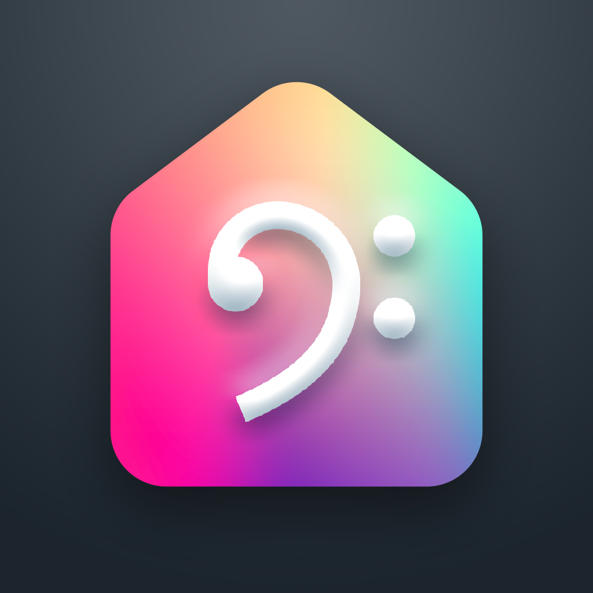

  

# 𝄢 MusicSync for Home Assistant

---

MusicSync is an iOS app that allows you to synchronize any kind of light entity accessible via Home Assistant with your music in real-time. 
It uses the microphone of your phone to analyze the music and sync the lights accordingly. 

With MusicSync, you can create a dynamic and immersive lighting experience for your music listening sessions. 
It's perfect for parties, events, or simply enjoying your favorite songs at home. 
The application is easy to use and highly customizable, giving you full control over your lighting effects.

> **NOTE:**  MusicSync is currently in beta and only available for iOS and iPadOS for now. An Android version is planned for the future.

## Getting started

---

> **NOTE:**  The app is not yet available on the App Store.

### Method 1: Joining TestFlight
The easiest way to get started is to join the TestFlight beta program.

### [👉 Join TestFlight](https://testflight.apple.com/join/4nCUW4lI)

1. Install TestFlight on the iOS or iPadOS device that you’ll use for testing.
2. Tap the public link on your device.
3. If you’re a new tester for the app, tap Accept.
4. Tap Install to install the app on your device.
5. If you’re a returning tester, tap Update or Open.

### Method2: Clone the repository
Alternatively, you can clone the repository and compile the app yourself using Xcode. 
Then you could run it on your device or simulator.

## Features

---

